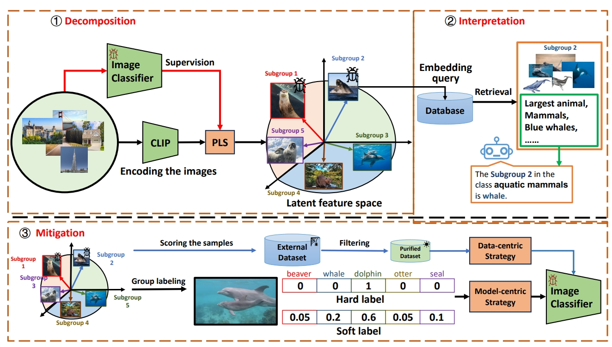

# DIM

This repository contains code to reproduce results from the paper:

[Discover and Mitigate Multiple Biased Subgroups in Image Classifiers](https://github.com/ZhangAIPI/DIM) (CVPR 2024)

*[Zeliang Zhang](https://zhangaipi.github.io/), *[Mingqian Feng](https://openreview.net/profile?id=~Mingqian_Feng1), [Zhiheng Li](https://zhiheng.li/), [Chenliang Xu](https://www.cs.rochester.edu/~cxu22/)




TL; DR: we propose Decomposition, Interpretation, and Mitigation (DIM), a novel method to address a more challenging but also more practical problem of discovering multiple biased subgroups in image classifiers
## Requirements

+ python >= 3.6.5
+ pytorch == 1.7.x
+ numpy >= 1.15.4
+ clip-retrieval >= 2.0

## Qucik Start

There are three steps in our method, namely the D(iscovery), I(dentification), and M(itigation). We present the code implementation in discovery.py, identification.py, and mitigation.py of the DIM folder. 


## Citation

If you find the idea or code useful for your research, please consider citing our [paper](https://github.com/ZhangAIPI/DIM):

```
@inproceedings{zhang2024DIM,
  author={Zeliang Zhang and Mingqian Feng and Zhiheng Li and Chenliang Xu},
  booktitle = {The Thirty-Fourth IEEE/CVF Conference on Computer Vision and Pattern Recognition},
  title = {Discover and Mitigate Multiple Biased Subgroups in Image Classifiers},
  year = {2024},
}
```

## Contact

Questions and suggestions can be sent to hust0426@gmail.com.